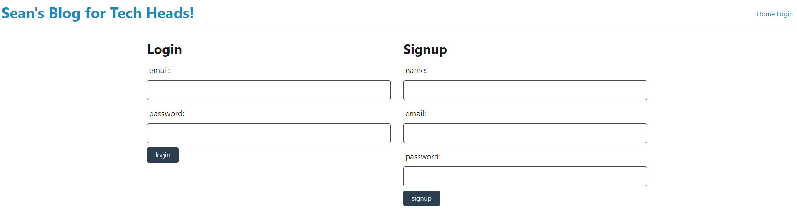
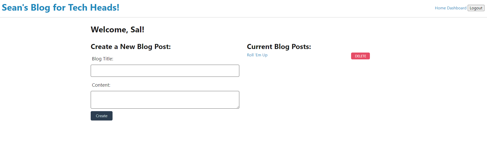

# Seans-Blog-For-Tech-Heads

## Description
This website was designed to provide a space for tech-users to blog about anything and everything related to tech! Users can create a profile, create a blog entry, comment on other blog entries, delete and edit their own comments, and delete their own blog entries.

## Visual

## Technology
This program was built using handlebars for display purposes, controllers for routing, and models for object-oriented programming functionality. 

## Authors and Acknowledgements
Sean Duiser:
sean.duiser.develop@gmail.com

## Deployed Link
https://github.com/Sean-Duiser/Seans-blog-for-tech-heads
  
https://sean-duiser.github.io/Seans-blog-for-tech-heads/